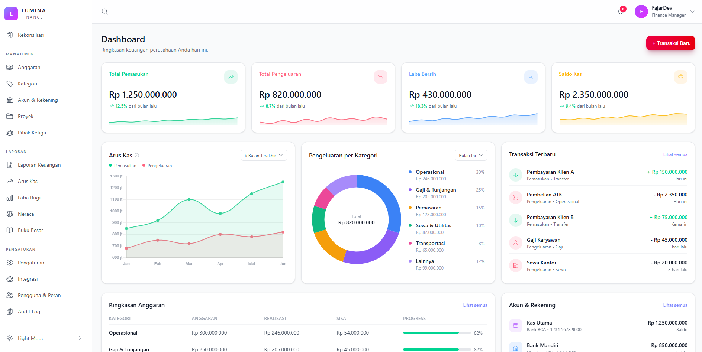
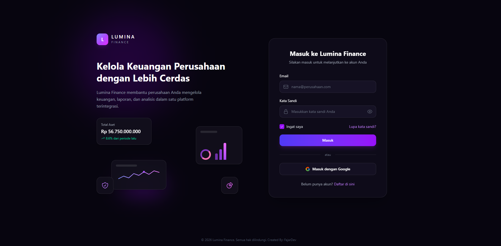

# Lumina

**Lumina** adalah template UI untuk aplikasi manajemen keuangan perusahaan dengan fitur lengkap — mulai dari dashboard ringkasan, pencatatan pengeluaran, grafik arus kas, hingga manajemen anggaran dan akun.

> ⚠️ **Catatan:** Repositori ini hanya berisi **template UI (frontend)**. Belum terhubung ke backend/API — semua data yang tampil masih berupa data dummy/mock untuk keperluan demo tampilan.

---

## ✨ Fitur

### 📊 Dashboard
Ringkasan keuangan perusahaan secara real-time: Total Pemasukan, Total Pengeluaran, Laba Bersih, Saldo Kas, grafik Arus Kas, Pengeluaran per Kategori, Transaksi Terbaru, Ringkasan Anggaran, dan daftar Akun & Rekening.

### 🗂️ Manajemen
- **Anggaran** — Kelola dan pantau anggaran perusahaan
- **Kategori** — Pengelompokan transaksi pemasukan/pengeluaran
- **Akun & Rekening** — Daftar dan kelola rekening bank perusahaan
- **Proyek** — Pelacakan keuangan berbasis proyek
- **Pihak Ketiga** — Manajemen data vendor/klien/rekanan

### 🧾 Rekonsiliasi
Pencocokan data transaksi antara catatan internal dan mutasi rekening bank.

### 📈 Laporan
- **Laporan Keuangan** — Ringkasan laporan keuangan perusahaan
- **Arus Kas** — Analisis cash flow masuk dan keluar
- **Laba Rugi** — Laporan profit & loss
- **Neraca** — Laporan posisi keuangan (assets, liabilities, equity)
- **Buku Besar** — Pencatatan jurnal umum (general ledger)

### ⚙️ Pengaturan
- **Pengaturan** — Konfigurasi umum aplikasi
- **Integrasi** — Koneksi ke layanan/aplikasi pihak ketiga
- **Pengguna & Peran** — Manajemen user dan role/hak akses
- **Audit Log** — Riwayat aktivitas dan perubahan data

### 🎨 Lainnya
- 🌗 Dukungan tema terang & gelap (Light/Dark Mode)
- 📱 Tampilan responsif (mobile, tablet, desktop)
- ➕ Modal form untuk menambah transaksi baru
- 🔔 Notifikasi
- 🔍 Pencarian global

---

## 🛠️ Dibuat Dengan

- [Vue 3](https://vuejs.org/)
- [Vite](https://vitejs.dev/)
- [Vue Router](https://router.vuejs.org/)
- [Tailwind CSS](https://tailwindcss.com/)
- JavaScript (ES2020+)
- HTML5
- CSS3
- Vue Chart (untuk visualisasi grafik)

---

## 📋 Requirement

Sebelum menjalankan proyek ini, pastikan sudah terinstall:

- [Node.js](https://nodejs.org/) versi **18.x** atau lebih baru
- **npm** (biasanya sudah termasuk saat instal Node.js) atau **yarn**
- Git

Cek versi Node.js dan npm dengan perintah:

```bash
node -v
npm -v
```

---

## 🚀 Cara Install

1. **Clone repositori**

   ```bash
   git clone https://github.com/UIDesign-Stack/Lumina.git
   ```

2. **Masuk ke folder proyek**

   ```bash
   cd Lumina
   ```

3. **Install dependencies**

   ```bash
   npm install
   ```

4. **Jalankan mode development**

   ```bash
   npm run dev
   ```

   Buka browser dan akses `http://localhost:5173` (atau port lain sesuai output terminal).

5. **Build untuk production** (opsional)

   ```bash
   npm run build
   ```

   Hasil build akan tersedia di folder `dist/`.

---

## 🤝 Kontribusi

Proyek ini bersifat **open source** dan terbuka untuk kontribusi. Jika ingin berkontribusi:

1. Fork repositori ini
2. Buat branch baru (`git checkout -b fitur-baru`)
3. Commit perubahan (`git commit -m 'Menambahkan fitur baru'`)
4. Push ke branch (`git push origin fitur-baru`)
5. Buka Pull Request

---

## 📄 Lisensi

Proyek ini dilisensikan di bawah [MIT License](LICENSE).

---

## 🔗 Repository

[https://github.com/UIDesign-Stack/Lumina](https://github.com/UIDesign-Stack/Lumina)